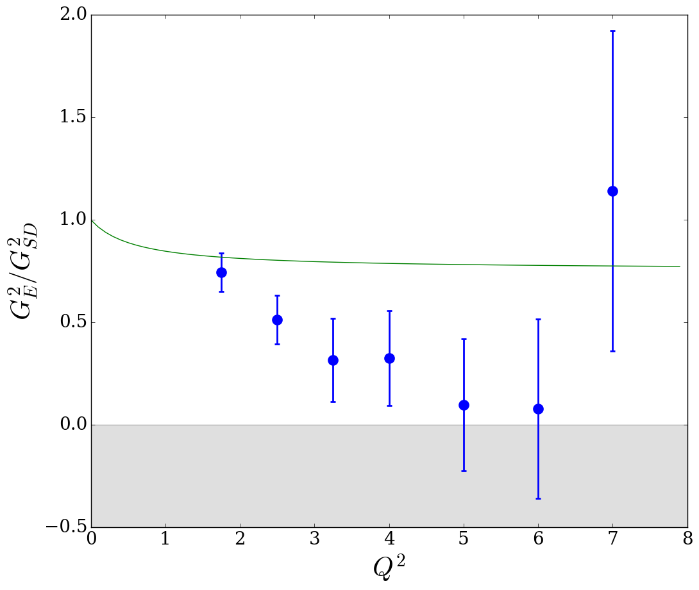
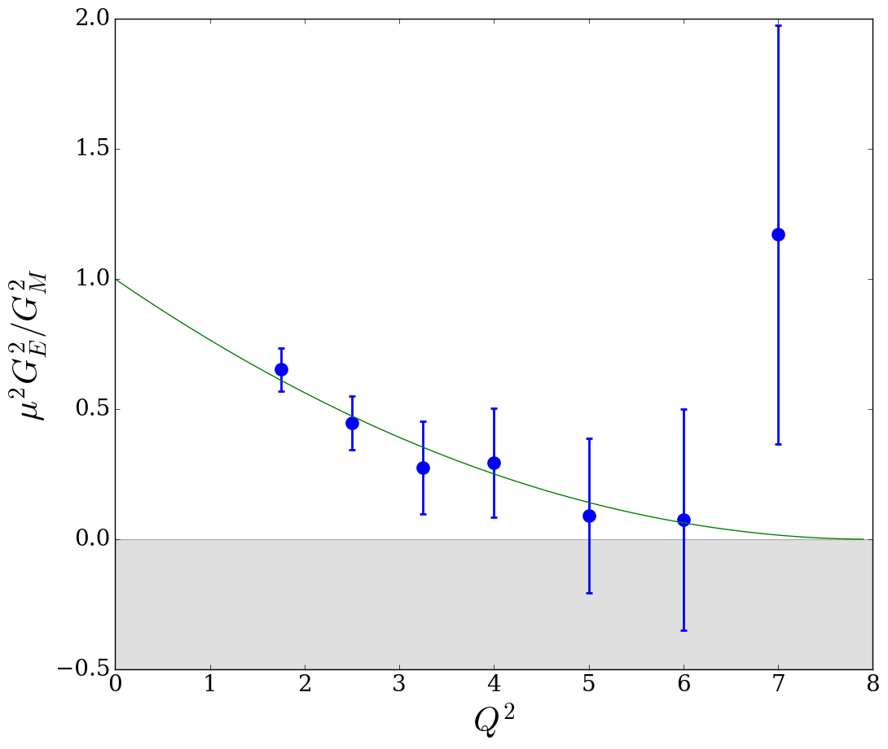

# Frequentist Analysis of Rosenbluth Data: A Study of Proton Form Factor Measurements

These are the Python scripts and subsequent results from this reanalysis of electron-proton scattering data from the NE11 experiment at SLAC (see [this paper](https://doi.org/10.1103/PhysRevD.50.5491)).




## Dependencies
The scripts are written in Python 3.5.2, so **Python 3.0 or greater** is required. **numpy**, **scipy**, and **matplotlib** are required.

## Contents
File/Path name | Description
-------------- | ------------
FormFactors/ | Plots (PNG files) of form factors and their ratios versus Q^2 for three different analyses, with and without radiative corrections applied (results with them have "rc")
SuperRosenbluth/ | Data files, output files, and form factor plots of Jlab Hall A data (Super Rosenbluth) at Q^2 = 2.64, 3.20, and 4.10.
chi_square.py | Performs chi-squared analysis of scattering data as reduced cross sections versus epsilon. Generates chi-squared distribution histograms.
data.csv | 8 GeV scattering data from SLAC NE11, reported by Andivahis et al. 1994
data2.csv | Annotated 8 GeV and 1.6 GeV scattering data from SLAC NE11, reported by Andivahis et al. 1994
data3.csv | **(not in use)** Annotated 8 GeV and 1.6 GeV scattering data from SLAC NE11, reported by Andivahis et al. 1994<br>1.6 GeV cross sections and errors are multiplied by a normalizing factor of 0.958.
data4.csv | **(not in use)** Annotated 8 GeV and 1.6 GeV scattering data from SLAC NE11, reported by Andivahis et al. 1994<br>1.6 GeV cross sections and errors are multiplied by a normalizing factor of 0.958. Includes values of E'.
data5.csv | Annotated 8 GeV and 1.6 GeV scattering data from SLAC NE11, reported by Andivahis et al. 1994. Rows where angle ~= 90 degrees are marked to be multiplied by a normalizing factor.
data_rc.csv | Annotated 8 GeV and 1.6 GeV scattering data from SLAC NE11, reported by Andivahis et al. 1994, with cross sections and their errors multiplied by radiative correction factors (Blunden and Melnitchouk 2017) for 1.75 <= Q^2 <= 5.0.
data_rc2.csv | Annotated 8 GeV and 1.6 GeV scattering data from SLAC NE11, reported by Andivahis et al. 1994, with cross sections and their errors multiplied by radiative correction factors (Blunden and Melnitchouk 2017) for 1.75 <= Q^2 <= 5.0. Rows where angle ~= 90 degrees are marked to be multiplied by a normalizing factor.
ff_plot.py | Generates plots of form factors (seen above) based on results CSVs generated by **rosenbluth.py**
latexify.py | **(not in use)** Converts results CSVs generated by **rosenbluth.py** to LaTeX syntax for tables
rosenbluth.py | Main analysis. Computes form factors and their errors given an input file and normalization factor. Generates output CSV files and form factor distribution histograms.

## How to Use
### rosenbluth.py
Analysis without any normalization of scattering data.
```
python rosenbluth.py data2.csv
```
Analysis with normalization of 1.6 GeV cross sections by 0.958.
```
python rosenbluth.py data2.csv 0.958
```
Analysis with normalization of 8 GeV cross sections where angle ~= 90 degrees by 0.958.
```
python rosenbluth.py data5.csv 0.958
```

### chi_square.py
Chi-squared analysis without any normalization of scattering data.
```
python chi_square.py data2.csv
```
Chi-squared analysis with normalization of 1.6 GeV cross sections by 0.958.
```
python chi_square.py data2.csv 0.958
```
Chi-squared analysis with normalization of 8 GeV cross sections where angle ~= 90 degrees by 0.958.
```
python chi_square.py data5.csv 0.958
```

### ff_plot.py
Plot form factors from 1 or more output files **located in a /Figures/ subdirectory by default or other subdirectory if path is specified in argument** (generated by rosenbluth.py)
```
python ff_plot.py {results 1} {results 2} {results 3} ...
```
